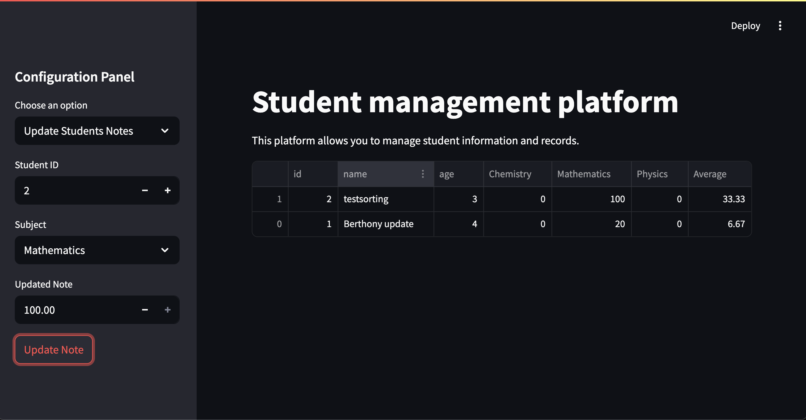

# 🎓 Student Management Platform

The **Student Management Platform** is a Streamlit-based web application that enables educational institutions, teachers, or administrative staff to efficiently manage student records and academic performance. This tool simplifies the process of adding, updating, and analyzing student data in a user-friendly and interactive interface.

Visit the ➡️ [deployed demo](https://htsull-student-management-platform-main-62ddtm.streamlit.app/) on the Steamlit Cloud Platform or get the source code ➡️ [here](https://github.com/htsull/student-management-platform).

---

## 📌 Features

### 👨‍🎓 Student Management

- **Add New Students**: Enter the student's name and age to register them in the system. Each student is assigned a unique ID automatically.
- **Update Student Info**: Modify a student's name and age using their ID.
- **Delete Students**: Permanently remove a student from the system by ID. This also removes their corresponding grades.
- **Validation**: The app includes built-in validations for name uniqueness, proper formatting, and age constraints.

### 📚 Grade Management

- **Initialize Grades**: Upon adding a new student, default grades are initialized for all subjects.
- **Update Grades**: Easily update a student's grade for any subject from the sidebar.
- **Delete Grades**: When a student is deleted, their associated grades are also removed to maintain data integrity.

### 📊 Data Visualization

- **Interactive Table**: A detailed table displays student information alongside their grades per subject, enabling quick performance review.
- **Real-time Refresh**: All actions like adding, updating, or deleting trigger a live refresh using `st.rerun()` to ensure the UI is always up-to-date.

---

## 📁 Data Structure

- **etudiants.json**: Stores student data in JSON format with fields: `id`, `name`, and `age`.
- **notes.json**: Stores student grades with fields: `student_id`, `subject`, and `note`.

Example format:

```json

# students item
{
	"id": 1,
	"name": "Alice",
	"age": 20
}

# notes item

    {
        "id": 1,
        "student_id": 1,
        "subject": "Mathematics",
        "note": 20.0
    }

```

## 📸 Screenshot

Here is a preview of the application:



## 🏗️ Project Architecture

```
│
├── .streamlit
    └── config.toml              # Streamlit configuration settings (e.g. theme, layout)
├── .venv                        # # Virtual environment directory for managing project dependencies
├── data/
│   ├── etudiants.json           # Contains student data
│   └── notes.json               # Contains grades per student and subject
│
├── functions/
│   ├── gestion_etudiants.py     # Group 1 functions: add, delete, display students
│   ├── gestion_notes.py         # Group 2 functions: add, delete, display grades
│   ├── analyse_notes.py         # Group 3 functions: calculate averages and generate report cards
    └── helpers.py               # Utility functions used across multiple modules (e.g., ID checks, name validation)
│
├── main.py                      # Main script to run and test all functionalities
├── README.md                    # Project description, goals, and usage instructions
└── requirements.txt             # Project Dependencies
```

## ⚙️ Tech Stack

- Streamlit: For building the interactive frontend
- Python: Core programming language
- Pandas: For data manipulation and transformation
- JSON: Used for lightweight, file-based data storage

## 🚀 How to Run

1. Clone the repository:

```bash
git clone https://github.com/your-username/student-management-platform.git
cd student-management-platform

```

2. Install dependencies:

```bash
pip install -r requirements.txt
```

3. Launch the app:

```bash
streamlit run main.py
```

## 🔒 Notes

- This app uses simple file-based persistence (.json). For large-scale deployment, integration with a proper database (e.g., SQLite, PostgreSQL) is recommended.
- All student and note operations are atomic — changes are saved immediately to avoid data loss on app reload.

## 💡 Future Improvements

- Add authentication and user roles (admin/teacher view).
- Add visual analytics (grade distributions, trends).
- Database integration for scalability.
- Subject management (create/edit/delete subjects dynamically).
- Authentification

## 📬 Contact

For questions, suggestions, or collaborations, feel free to contact subspam304@example.com.
